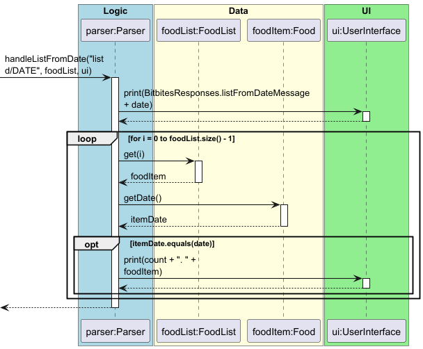
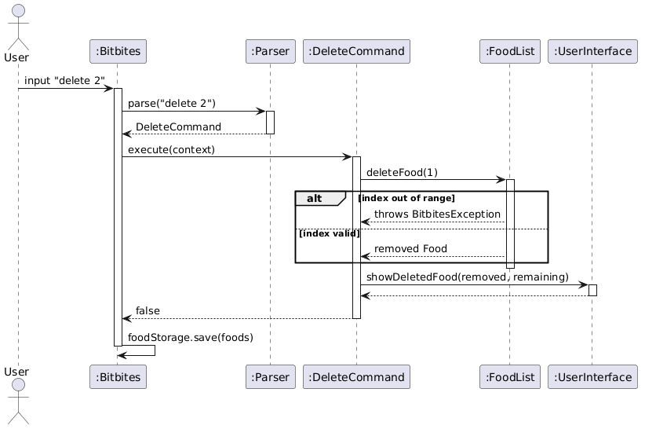
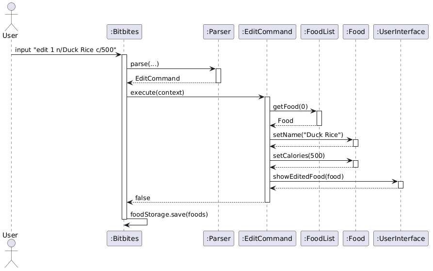
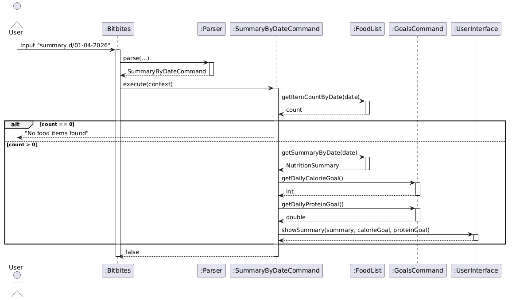
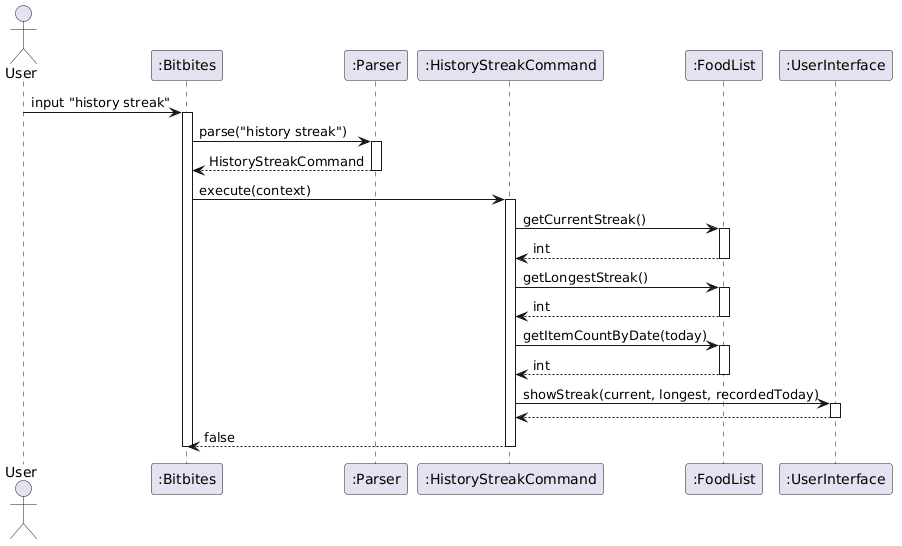

'# BitBites Developer Guide

## Acknowledgements

{list here sources of all reused/adapted ideas, code, documentation, and third-party libraries -- include links to the original source as well}

## Design & implementation

{Describe the design and implementation of the product. Use UML diagrams and short code snippets where applicable.}

### 1. Listing Food Items `list`
The `list` feature provides users with the ability to view their logged food items. It is implemented with two primary execution paths to handle different user needs:
1. **List All:** Displays the entire history of logged food items.
2. **List by Date:** Filters and displays only the food items consumed on a specified date.

#### 1.1 Implementation Details
The feature is driven by two main methods: `handleListAll()` and `handleListFromDate()`. Both methods depend on the `FoodList` component to retrieve data and the `UserInterface` to display the results to the user.

**Executing `list` (All Items):**
When the user inputs the `list` command without any arguments, `handleListAll()` is invoked.
1. The system prints a standard header message (`BitbitesResponses.listMessage`).
2. It loops through the `FoodList` from index `0` to `foodList.size() - 1`.
3. It prints each `Food` object sequentially, utilising the object's overridden `toString()` method, prefixed by a 1-based index.

**Executing `list d/DATE` (Filtered by Date):**
When the user inputs the `list` command followed by the date parameter (e.g., `list d/2026-03-27`), `handleListFromDate()` is invoked. The execution follows these steps:
1. **Parsing and Validation:** The raw command string is split using the `d/` delimiter. The method verifies that the array length is at least 2. If the date argument is missing, it throws a `BitbitesException`.
2. **Defensive Programming:** Internal `assert` statements are used to guarantee that the command strictly follows the expected `list` prefix and that the extracted date string is not empty.
3. **Filtering:** The method extracts the target `date` string. It initialises a local `count` variable at 1 to ensure the printed list maintains a continuous numerical sequence.
4. **Execution:** The system iterates over every item in the `FoodList`. For each item, it compares the item's stored date with the target `date`. If a match is found, it is printed to the console and the `count` is incremented.

Below is the sequence diagram illustrating the execution flow of the `handleListFromDate` method:

### 2. Adding a Food Item `add`
The `add` feature allows users to log a new food entry into the tracker. It is implemented with a single execution path that handles parsing, validation, and storage of the new food item.

#### 2.1 Implementation Details
The feature is driven by the `handleAdd()` method in `Parser.java`. It depends on the `FoodList` component to store data and the `UserInterface` to display feedback to the user.

**Executing `add n/NAME c/CALORIES p/PROTEIN d/DATE`:**
When the user inputs the `add` command followed by the required parameters, `handleAdd()` is invoked. The execution follows these steps:
1. **Prefix Validation:** The method checks that all four required prefixes (`n/`, `c/`, `p/`, `d/`) are present in the command. If any are missing, the correct format reminder is printed and execution stops early.
2. **Field Extraction:** Each field is extracted using `String.substring()` based on the positions of the prefixes. Extracted values are trimmed of leading and trailing whitespace.
3. **Empty Field Check:** If any extracted field is empty after trimming, the format reminder is displayed again and execution stops early.
4. **Type Parsing and Validation:** `calories` is parsed as an `int` and `protein` as a `double`. Both values must be non-negative. A `NumberFormatException` is caught if parsing fails, and a descriptive error is shown to the user.
5. **Date Validation:** The date string is validated against the regex `\d{4}-\d{2}-\d{2}`. If the format does not match, an error message is shown.
6. **Defensive Programming:** Internal `assert` statements verify that the name is non-empty, values are non-negative, and the date format is correct before the object is created.
7. **Food Creation:** A new `Food` object is constructed with the validated fields and added to the `FoodList` via `addFood()`. A confirmation message is printed to the user.

Below is the sequence diagram illustrating the execution flow of the `handleAdd` method:

### 3. Exiting the Application `exit`
The `exit` feature allows users to terminate the application safely when they are done.  
It is implemented as a direct command branch in `Parser.parse(...)` and integrates with the main application loop in `Bitbites`.

#### 3.1 Implementation Details
When the user inputs `exit`, the following execution flow occurs:

1. **Command Matching:** `Parser.parse(...)` checks whether the trimmed input is exactly `exit`.
2. **User Feedback:** The parser invokes `ui.showExit()` to display a farewell message.

### 4. Deleting a Food Item `delete`
The `delete` feature allows users to remove a logged food item from the list by its
displayed index. After deletion, a daily progress summary is shown to reflect the
updated intake against the user's goals.

#### 4.1 Implementation Details
The feature is implemented in `DeleteCommand`, following the Command Pattern.
`Parser` creates the command object and `Bitbites` calls `execute(context)`.

**Executing `delete INDEX`:**
1. **Parsing and Validation:** The command is split by space. If the index is missing,
   a `BitbitesException` is thrown.
2. **Index Conversion:** The index is parsed to `int` and converted from 1-based to
   0-based. Non-numeric input throws a `BitbitesException`.
3. **Defensive Programming:** An `assert` verifies the converted index is non-negative.
4. **Deletion:** `FoodList.deleteFood(index)` performs bounds checking internally and
   removes the item.
5. **Postcondition Check:** An `assert` verifies `foodList.size()` decreased by 1.
6. **Confirmation:** `ui.showDeletedFood()` prints the removed item and remaining count.
7. **Goal Progress:** `GoalsCommand.showDailyProgress()` prints today's intake against
   the daily goal.
8. **Persistence:** `foodStorage.save(foods)` is called in the main loop after execution.

### 5. Editing a Food Item `edit`
The `edit` feature allows users to update one or more fields of an existing food item
without deleting and re-adding it. Only the specified fields are changed.
**Format:** `edit INDEX [n/NAME] [c/CALORIES] [p/PROTEIN] [d/DATE]`
At least one field must be provided.

#### 5.1 Implementation Details
**Executing `edit INDEX [fields]`:**
1. **Parsing:** The command is split into three parts: keyword, index, and fields string.
2. **Index Conversion:** Same as `DeleteCommand`.
3. **Field Detection:** The fields string is checked for `n/`, `c/`, `p/`, `d/`.
   At least one must be present or a `BitbitesException` is thrown.
4. **In-place Update:** `FoodList.getFood(index)` returns a reference to the existing
   `Food` object. Each field is extracted using `extractField()` which stops at the
   next prefix, then applied via the corresponding setter.
5. **Validation:** Calories and protein must be non-negative. Date must match
   `\d{2}-\d{2}-\d{4}`.
6. **Confirmation:** `ui.showEditedFood()` prints the updated food item.
7. **Persistence:** `foodStorage.save(foods)` is called in the main loop.

### 6. Help Command `help`
The `help` command displays a summary of all available commands and their formats.
**Format:** `help`

#### 6.1 Implementation Details
`HelpCommand.execute()` delegates entirely to `ui.showHelp()`, which prints `BitbitesResponses.helpMessage`. No data access or modification occurs.

### 7. Summary Commands `summary`
The `summary` feature provides nutritional breakdowns for logged food items. It supports four sub-commands.

| Command | Description |
|---------|-------------|
| `summary d/DATE` | Summary for a specific date |
| `summary from/DATE1 to/DATE2` | Trend across a date range |
| `summary compare d/DATE1 d/DATE2` | Comparison of two days |

#### 7.1 Implementation Details
Each sub-command is a dedicated Command class. All retrieve `NutritionSummary` objects from `FoodList` and pass them to `UserInterface`.

`NutritionSummary` stores aggregated `totalCalories`, `totalProtein`, `itemCount`, and the list of `Food` items. `ProgressBar.generateSegmented()` generates a bar
where each segment's width represents that meal's calorie share of the day's total.

**`summary d/DATE`:**
1. The date is extracted after `d/`.
2. If no items exist for the date, a message is shown and execution stops.
3. Goal values are retrieved from `GoalsCommand.getDailyCalorieGoal()` and `getDailyProteinGoal()`.
4. `ui.showSummary(summary, calorieGoal, proteinGoal)` prints the breakdown and goal status.

**`summary from/DATE1 to/DATE2`:**
1. Both `from/` and `to/` prefixes must be present.
2. Dates are parsed using `LocalDate.parse()` with `dd-MM-yyyy` formatter.
3. If `from` is after `to`, a `BitbitesException` is thrown.
4. `FoodList.getSummariesInRange()` returns daily summaries within the range.
5. If no summaries found, a message is shown and execution stops.
6. `ui.showSummaryRange()` displays each day's bar scaled to the highest-calorie day.

**`summary compare d/DATE1 d/DATE2`:**
1. The command is split by `d/` — at least 3 parts must exist.
2. Both dates are extracted and checked for emptiness.
3. If either date has no items, a message is shown and execution stops early.
4. `FoodList.getSummaryByDate()` is called for each date.
5. `ui.showSummaryCompare()` displays both days side by side with calorie and protein differences.

### 8. History Commands `history`
The `history` feature shows a chronological log of all recorded days. It supports
four sub-commands.

| Command | Description |
|---------|-------------|
| `history` | All recorded days with breakdown bars |
| `history /top N` | Top N highest calorie days |
| `history /best N` | Top N days closest to daily calorie goal |
| `history streak` | Current and longest consecutive recording streak |

#### 8.1 Implementation Details
**`history` and `history /top N`:**

`HistoryCommand` and `HistoryTopCommand` retrieve `NutritionSummary` lists from
`FoodList`. Each day's bar in `showHistory()` is scaled relative to the
highest-calorie day — the busiest day fills the full bar width and others are
proportionally shorter.

**`history`:**
`HistoryCommand` checks whether any food has been logged today using
`LocalDate.now()`. It retrieves all daily summaries and passes them with a
`recordedToday` flag to `ui.showHistory()`, which appends a reminder if today
has not been logged.

**`history /top N`:**
`HistoryTopCommand` splits the command by `/top` to extract `N`. It calls
`foodList.getTopDaysByCalories(N)` which sorts summaries by total calories
descending and returns the top N.

**`history /best N`:**
`HistoryBestCommand` calls `foodList.getDaysClosestToGoal(n, calorieGoal)`, which
sorts summaries by `|totalCalories - dailyCalorieGoal|` ascending, surfacing the
days where intake was closest to the user's target.

**`history streak`:**
`HistoryStreakCommand` calls `getCurrentStreak()` and `getLongestStreak()`.
Streak calculation uses `LocalDate.parse()` with `dd-MM-yyyy` format to compare
consecutive dates. `getCurrentStreak()` also checks whether the last recorded date
is today or yesterday using `LocalDate.now()` — if neither, the streak returns 0.

## Product scope
### Target user profile

{Describe the target user profile}

### Value proposition

{Describe the value proposition: what problem does it solve?}

## User Stories

|Version| As a ... | I want to ... | So that I can ...|
|--------|----------|---------------|------------------|
|v1.0|new user|see usage instructions|refer to them when I forget how to use the application|
|v2.0|user|find a to-do item by name|locate a to-do without having to go through the entire list|

## Non-Functional Requirements

{Give non-functional requirements}

## Glossary

* *glossary item* - Definition

## Instructions for manual testing

{Give instructions on how to do a manual product testing e.g., how to load sample data to be used for testing}
'