# BitBites Developer Guide

## Acknowledgements

{list here sources of all reused/adapted ideas, code, documentation, and third-party libraries -- include links to the original source as well}

The following resources, libraries, and tools were instrumental in the development of this project:
Java Standard Library: Leveraged as the foundational framework for core logic implementation, efficient data structure management, and stream-based I/O operations.
Gradle Build Tool: Used as the primary build automation system.
Checkstyle: Integrated to ensure strict adherence to the Google Java Style Guide.

---

## Design & Implementation

{Describe the design and implementation of the product. Use UML diagrams and short code snippets where applicable.}

---

### 1. Design: Command Pattern and AppContext

BitBites uses the **Command design pattern** to encapsulate each user action as a discrete object. This makes it straightforward to add new features without modifying existing parsing or execution logic.

#### 1.1 The `Command` Abstract Class

All executable actions extend the abstract `Command` class in `command/Command.java`. Each subclass must implement:

```
execute(AppContext context) → boolean
```

The return value signals whether the application should exit (`true`) or continue (`false`). This keeps the main application loop simple and decoupled from individual command logic.

`Command` also provides two shared utility methods used by subclasses that parse prefix-based input (e.g., `n/NAME`, `dc/CALORIES`):

- `extractValue(command, prefix, nextPrefix)` — extracts the value between two known prefixes.
- `nextPrefix(command, currentPrefix, prefixes[])` — finds the closest following prefix to determine value boundaries.

These utility methods are inherited by `GoalsCommand`, `ProfileCommand`, `AddCommand`, and others, avoiding duplicated parsing logic across the codebase.

The class diagram below shows the relationship between `Command` and its concrete subclasses:

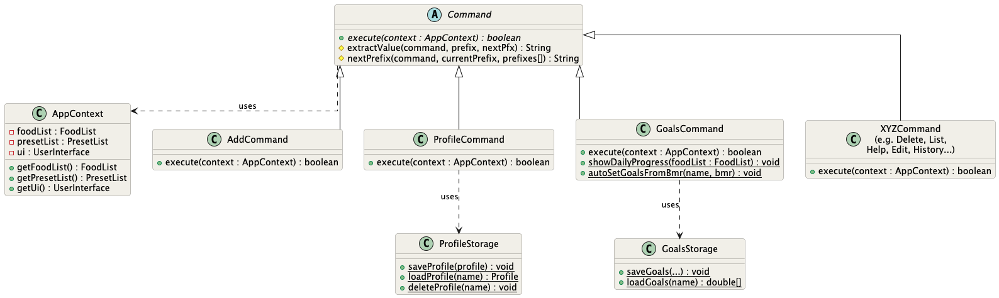

#### 1.2 The `AppContext` Class

Rather than passing `FoodList`, `PresetList`, and `UserInterface` as separate parameters to every command, BitBites wraps them in a single `AppContext` object (following the **Context Object pattern**). This means:

- Adding a new component to the application does not require updating every `execute()` method signature.
- Each command retrieves only what it needs from the context.

A typical command begins like this:

```java
FoodList foodList = context.getFoodList();
UserInterface ui = context.getUi();
```

`AppContext` is constructed once at application startup and passed through to every command execution.

---

### 2. Listing Food Items `list`

The `list` feature provides users with the ability to view their logged food items. It is implemented with two primary execution paths to handle different user needs:
1. **List All:** Displays the entire history of logged food items.
2. **List by Date:** Filters and displays only the food items consumed on a specified date.

#### 2.1 Implementation Details

The feature is driven by two main methods: `handleListAll()` and `handleListFromDate()`. Both methods depend on the `FoodList` component to retrieve data and the `UserInterface` to display the results to the user.

**Executing `list` (All Items):**
When the user inputs the `list` command without any arguments, `handleListAll()` is invoked.
1. The system prints a standard header message (`BitbitesResponses.listMessage`).
2. It loops through the `FoodList` from index `0` to `foodList.size() - 1`.
3. It prints each `Food` object sequentially, utilising the object's overridden `toString()` method, prefixed by a 1-based index.

**Executing `list d/DATE` (Filtered by Date):**
When the user inputs the `list` command followed by the date parameter (e.g., `list d/2026-03-27`), `handleListFromDate()` is invoked. The execution follows these steps:
1. **Parsing and Validation:** The raw command string is split using the `d/` delimiter. The method verifies that the array length is at least 2. If the date argument is missing, it throws a `BitbitesException`.
2. **Defensive Programming:** Internal `assert` statements are used to guarantee that the command strictly follows the expected `list` prefix and that the extracted date string is not empty.
3. **Filtering:** The method extracts the target `date` string. It initialises a local `count` variable at 1 to ensure the printed list maintains a continuous numerical sequence.
4. **Execution:** The system iterates over every item in the `FoodList`. For each item, it compares the item's stored date with the target `date`. If a match is found, it is printed to the console and the `count` is incremented.

Below is the sequence diagram illustrating the execution flow of the `handleListFromDate` method:

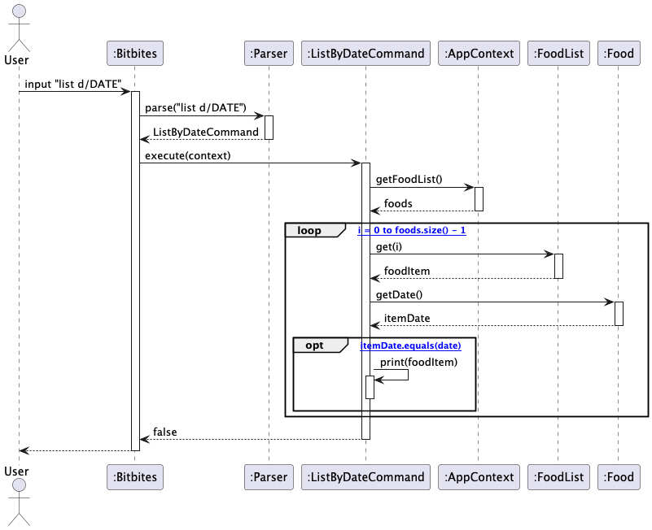

---

### 3. Adding a Food Item `add`

The `add` feature allows users to log a new food entry into the tracker. It is implemented with a single execution path that handles parsing, validation, and storage of the new food item.

#### 3.1 Implementation Details

The feature is driven by the `execute()` method in `AddCommand.java`. It depends on the `FoodList` component to store data and the `UserInterface` to display feedback to the user.

**Executing `add n/NAME c/CALORIES p/PROTEIN d/DATE`:**
When the user inputs the `add` command followed by the required parameters, `execute()` is invoked. The execution follows these steps:
1. **Prefix Validation:** The method checks that the required prefixes (`n/`, `c/`, `p/`) are present in the command. If any are missing, the correct format reminder is printed and execution stops early. `/d` is optional and will input the current date if omitted.
2. **Field Extraction:** Each field is extracted using `String.substring()` based on the positions of the prefixes. Extracted values are trimmed of leading and trailing whitespace.
3. **Empty Field Check:** If any extracted field is empty after trimming, the format reminder is displayed again and execution stops early.
4. **Type Parsing and Validation:** `calories` is parsed as an `int` and `protein` as a `double`. Both values must be non-negative. A `NumberFormatException` is caught if parsing fails, and a descriptive error is shown to the user.
5. **Date Validation:** The date string is validated against the regex `\d{2}-\d{2}-\d{4}`. If the format does not match, an error message is shown.
6. **Defensive Programming:** Internal `assert` statements verify that protein is non-negative and the date format is correct before the object is created.
7. **Food Creation and Goal Feedback:** A new `Food` object is constructed with the validated fields and added to the `FoodList` via `addFood()`. A confirmation message is printed, followed by a daily progress summary from `GoalsCommand.showDailyProgress()`.

Below is the sequence diagram illustrating the execution flow of the `add` command:

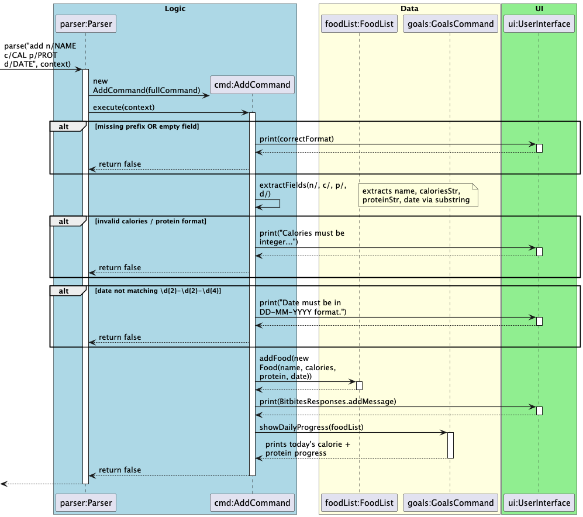

---

### 4. Editing a Food Item `edit`

The `edit` feature allows users to update one or more fields of an existing food item without deleting and re-adding it. Only the specified fields are changed.

**Format:** `edit INDEX [n/NAME] [c/CALORIES] [p/PROTEIN] [d/DATE]`

At least one field must be provided.

#### 4.1 Implementation Details

**Executing `edit INDEX [fields]`:**
1. **Parsing:** The command is split into three parts: keyword, index, and fields string.
2. **Index Conversion:** Same as `DeleteCommand`.
3. **Field Detection:** The fields string is checked for `n/`, `c/`, `p/`, `d/`. At least one must be present or a `BitbitesException` is thrown.
4. **In-place Update:** `FoodList.getFood(index)` returns a reference to the existing `Food` object. Each field is extracted using `extractField()` which stops at the next prefix, then applied via the corresponding setter.
5. **Validation:** Calories and protein must be non-negative. Date must match `\d{2}-\d{2}-\d{4}`.
6. **Confirmation:** `ui.showEditedFood()` prints the updated food item.
7. **Persistence:** `foodStorage.save(foods)` is called in the main loop.


---

### 5. Deleting a Food Item `delete`

The `delete` feature allows users to remove a logged food item from the list by its displayed index. After deletion, a daily progress summary is shown to reflect the updated intake against the user's goals.

#### 5.1 Implementation Details

The feature is implemented in `DeleteCommand`, following the Command Pattern. `Parser` creates the command object and `Bitbites` calls `execute(context)`.

**Executing `delete INDEX`:**
1. **Parsing and Validation:** The command is split by space. If the index is missing, a `BitbitesException` is thrown.
2. **Index Conversion:** The index is parsed to `int` and converted from 1-based to 0-based. Non-numeric input throws a `BitbitesException`.
3. **Defensive Programming:** An `assert` verifies the converted index is non-negative.
4. **Deletion:** `FoodList.deleteFood(index)` performs bounds checking internally and removes the item.
5. **Postcondition Check:** An `assert` verifies `foodList.size()` decreased by 1.
6. **Confirmation:** `ui.showDeletedFood()` prints the removed item and remaining count.
7. **Goal Progress:** `GoalsCommand.showDailyProgress()` prints today's intake against the daily goal.
8. **Persistence:** `foodStorage.save(foods)` is called in the main loop after execution.


---

### 6. Exiting the Application `exit`

The `exit` feature allows users to terminate the application safely when they are done. It is implemented as a direct command branch in `Parser.parse(...)` and integrates with the main application loop in `Bitbites`.

#### 6.1 Implementation Details

When the user inputs `exit`, the following execution flow occurs:

1. **Command Matching:** `Parser.parse(...)` checks whether the trimmed input is exactly `exit`.
2. **User Feedback:** The parser invokes `ui.showExit()` to display a farewell message.

---

### 7. Help Command `help`

The `help` command displays a summary of all available commands and their formats.

**Format:** `help`

#### 7.1 Implementation Details

`HelpCommand.execute()` delegates entirely to `ui.showHelp()`, which prints `BitbitesResponses.helpMessage`. No data access or modification occurs.

---

### 8. Motivational Messages `motivate`

The `motivate` feature provides personalized motivational messages and encouragement to users. This feature is designed to keep users engaged and motivated to maintain healthy eating habits.

**Format:** `motivate`

#### 8.1 Implementation Details

The feature is implemented in `MotivateCommand.java` with support for different motivation types (currently only random is active).

#### 8.2 Supported Motivation Types

Currently, only the **random** type is implemented, in next step we will focus on `progress` and `goals`:

| Type | Behaviour | Status |
|------|-----------|--------|
| `random` | Displays a random motivational message from a predefined list | ✓ Active |
| `progress` | Would display motivation based on today's daily goal progress | Commented out |
| `goals` | Would display motivation based on overall goal achievement | Commented out |

---

### 9. Finding Food Items `find`

The `find` feature provides users with search functionality to locate food items by name. This allows users to quickly retrieve and review previously logged meals.

**Format:** `find KEYWORD`

#### 9.1 Implementation Details

The feature is implemented in `FindCommand.java` and enables case-insensitive full-name matching of food items in the `FoodList`.

**Executing `find KEYWORD`:**

When the user inputs `find` followed by a search keyword, the following execution flow occurs:

1. **Keyword Extraction:** The command string is parsed to extract the keyword after `find `.
2. **Validation:** If no keyword is provided, a usage message is displayed and execution stops.
3. **Logger:** The find request is logged at `Level.INFO` for auditing purposes.
4. **Search:** `searchFoods(foodList, keyword)` iterates through all food items in `FoodList` and performs case-insensitive name matching using `toLowerCase()` to compare the item's name with the keyword.
5. **Results:** All matching food items are collected into a list.
6. **Display:** `displayResults(results, keyword)` prints the results with formatting:
   - If no matches are found, a "No food items found" message is displayed.
   - If matches are found, they are displayed with a count and formatted table.
7. **Logger:** The find command execution is logged at `Level.FINE`.

#### 9.2 Search Behavior

The search uses **exact name matching** (case-insensitive):

- Searching for `burger` will match items named `"Burger"`, `"BURGER"`, or `"burger"`.
- Searching for `burger` will **not** match `"cheeseburger"` or `"beef burger"` (partial matches are not supported).

#### 9.3 User Feedback

The feature provides clear visual feedback, for example:

```
========================================================
Search Results for: "burger"
========================================================
   Found 2 results:
   1. Burger - 250 kcal, 12g protein, 09-04-2026
   2. Burger - 300 kcal, 15g protein, 08-04-2026
```

---

### 10. Managing User Profiles `profile`

The `profile` feature allows each user to store and retrieve their personal physical attributes. It integrates with the `goals` feature to automatically set sensible calorie targets when a profile is saved.

#### 10.1 Implementation Details

**Supported sub-commands:**

| Command | Behaviour |
|---|---|
| `profile` | View the current user's saved profile |
| `profile set n/NAME g/GENDER a/AGE w/WEIGHT h/HEIGHT` | Create or update profile fields |
| `profile clear` | Delete the current user's profile file |

**Executing `profile set ...`:**

When the user provides one or more profile fields, `handleSetProfile()` is invoked. The steps are:

1. **Load Existing Profile:** `ProfileStorage.loadProfile(name)` is called first. If an existing profile is found, its current values are used as defaults so that only the supplied fields are changed — unchanged fields are preserved.
2. **Field Extraction:** Each field is extracted from the command string using the inherited `extractValue()` and `nextPrefix()` utilities from `Command`.
3. **Gender Validation:** The `g/` value must be exactly `"male"` or `"female"` (case-insensitive). Any other value causes an early return with an error message.
4. **Range Validation:** Age, weight, and height must all be non-negative. A check is performed before the `Profile` object is constructed.
5. **Persistence:** The updated `Profile` is saved to disk via `ProfileStorage.saveProfile(profile)`.
6. **BMR Auto-Set:** After saving, `GoalsCommand.autoSetGoalsFromBmr(name, profile.getBmr())` is called automatically to update the user's daily and weekly calorie goals based on their new BMR.

The sequence diagram below illustrates the execution of `profile set ...`:

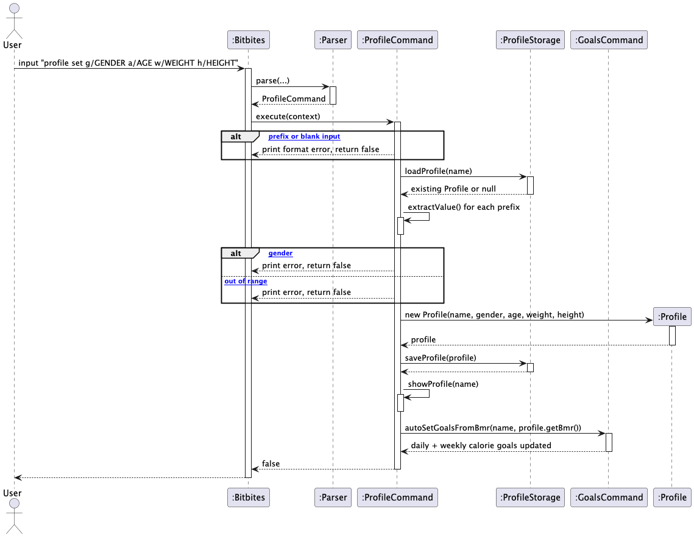

#### 10.2 The `Profile` Model

`Profile` stores five fields: `name`, `gender`, `age`, `weight` (kg), and `height` (cm). It derives two computed values:

- **BMI** — calculated as `weight / (height in metres)²`
- **BMR** — calculated using the Mifflin-St Jeor formula:
   - Male: `(10 × weight) + (6.25 × height) − (5 × age) + 5`
   - Female: `(10 × weight) + (6.25 × height) − (5 × age) − 161`

BMI is also categorised into `Underweight`, `Normal`, `Overweight`, or `Obese` based on standard thresholds.

---

### 11. Managing Nutritional Goals `goals`

The `goals` feature allows users to set daily and weekly calorie and protein targets, and view their current progress against those targets. Goals are persisted per user and are automatically set when a profile is saved.

#### 11.1 Implementation Details

The feature is driven by `GoalsCommand.java`, with persistence handled by `GoalsStorage.java`.

**Supported sub-commands:**

| Command | Behaviour |
|---|---|
| `goals` | View daily and weekly progress against current targets |
| `goals set dc/CAL dp/PROT wc/CAL wp/PROT` | Set one or more goal values |

All four goal values (`dc/`, `dp/`, `wc/`, `wp/`) are optional in a single `goals set` command — the user may supply any combination and only the specified fields are updated.

**Default goal values** (applied when no saved goals exist):

| Goal | Default |
|---|---|
| Daily calories | 2000 kcal |
| Daily protein | 50.0 g |
| Weekly calories | 14000 kcal |
| Weekly protein | 350.0 g |

**Executing `goals` (view progress):**

`showGoalsMenu()` is called. It computes today's totals and the current week's totals by iterating over the `FoodList` and comparing each item's date to today and to the Monday–Sunday window containing today. Results are printed alongside the saved targets, with a `(Goal reached!)` indicator when a target is met or exceeded.

**Executing `goals set ...`:**

`handleSetGoals()` parses each recognised prefix using the inherited `extractValue()` utility. For each prefix present, the value is parsed and validated (must be non-negative), the corresponding static field is updated, and a confirmation message is printed. All four values are then written to disk via `GoalsStorage.saveGoals()`.

**Goal persistence across sessions:**

Goals are loaded lazily at the start of each `GoalsCommand.execute()` call via `loadGoalsIfNeeded()`. This method calls `GoalsStorage.loadGoals()` and, if a saved file exists, overwrites the static defaults with the saved values.

**Static daily progress summary:**

`GoalsCommand.showDailyProgress(FoodList)` is a static utility method called by `AddCommand` (and any other command that modifies the food list) to print a brief progress summary after each change. This gives the user immediate feedback on how their latest entry affects their daily targets.

**Auto-setting goals from BMR:**

`GoalsCommand.autoSetGoalsFromBmr(name, bmr)` is called by `ProfileCommand` after a profile is saved. It sets the daily calorie goal to the user's BMR and the weekly goal to `BMR × 7`, then saves to disk. Protein goals are not changed by this auto-set.

The sequence diagram below illustrates the execution of `goals set ...`:

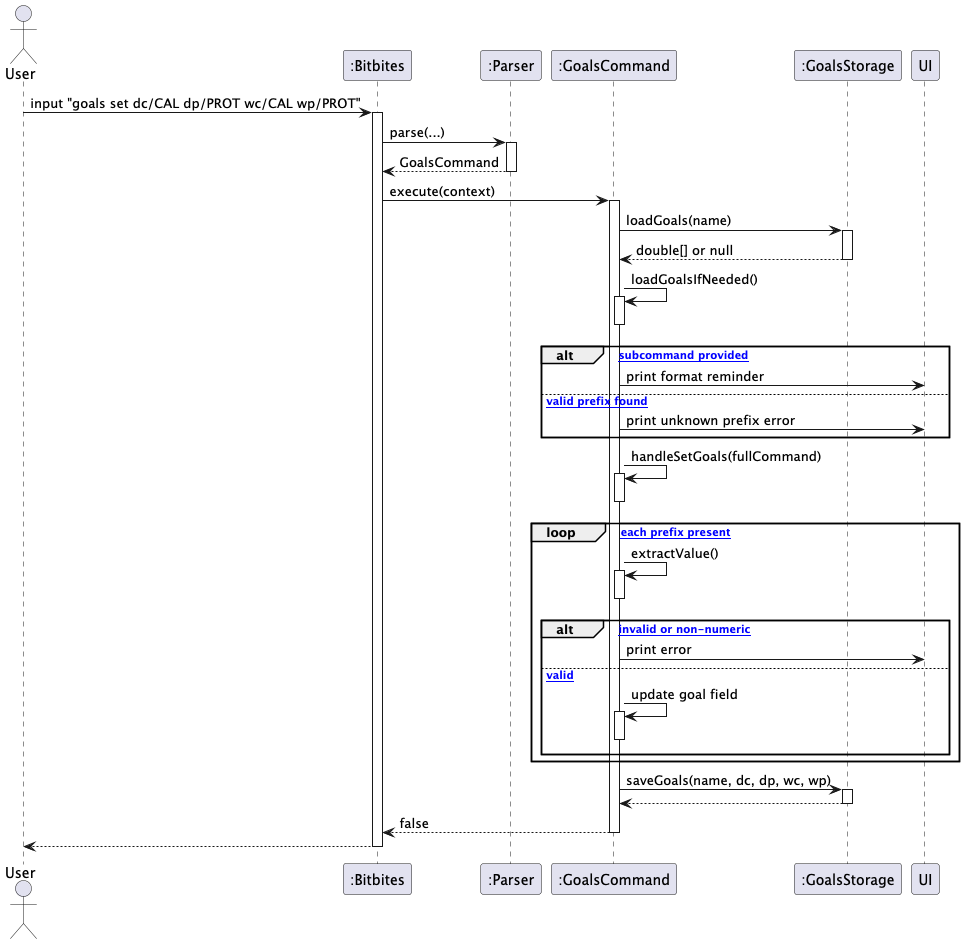

---

### 12. Summary Commands `summary`

The `summary` feature provides nutritional breakdowns for logged food items. It supports three sub-commands.

| Command | Description |
|---------|-------------|
| `summary d/DATE` | Summary for a specific date |
| `summary from/DATE1 to/DATE2` | Trend across a date range |
| `summary compare d/DATE1 d/DATE2` | Comparison of two days |

#### 12.1 Implementation Details

Each sub-command is a dedicated Command class. All retrieve `NutritionSummary` objects from `FoodList` and pass them to `UserInterface`.

`NutritionSummary` stores aggregated `totalCalories`, `totalProtein`, `itemCount`, and the list of `Food` items. `ProgressBar.generateSegmented()` generates a bar where each segment's width represents that meal's calorie share of the day's total.

**`summary d/DATE`:**
1. The date is extracted after `d/`.
2. If no items exist for the date, a message is shown and execution stops.
3. Goal values are retrieved from `GoalsCommand.getDailyCalorieGoal()` and `getDailyProteinGoal()`.
4. `ui.showSummary(summary, calorieGoal, proteinGoal)` prints the breakdown and goal status.

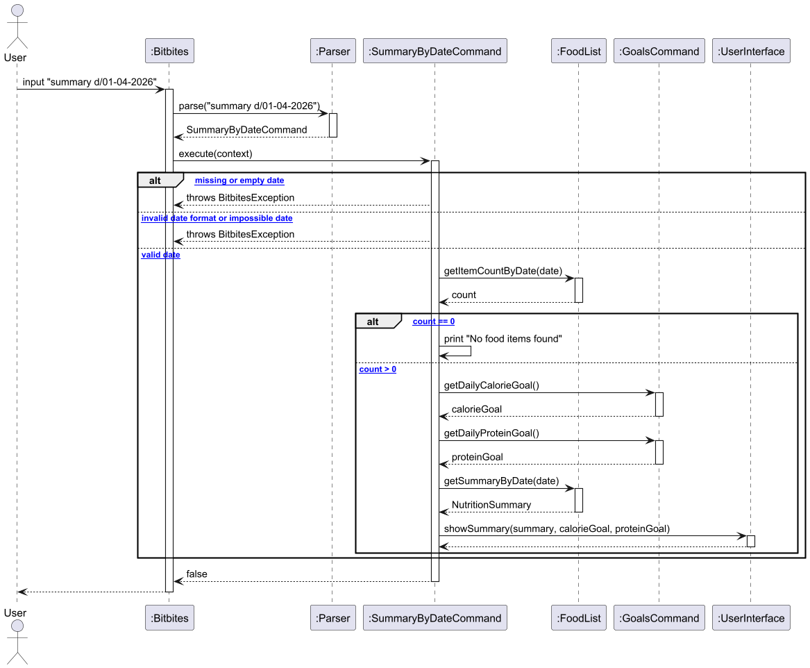

**`summary from/DATE1 to/DATE2`:**
1. Both `from/` and `to/` prefixes must be present.
2. Dates are parsed using `LocalDate.parse()` with `dd-MM-yyyy` formatter.
3. If `from` is after `to`, a `BitbitesException` is thrown.
4. `FoodList.getSummariesInRange()` returns daily summaries within the range.
5. If no summaries found, a message is shown and execution stops.
6. `ui.showSummaryRange()` displays each day's bar scaled to the highest-calorie day.

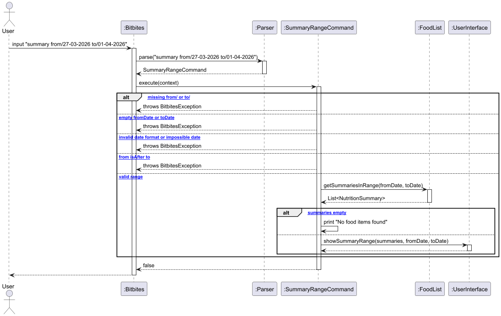

**`summary compare d/DATE1 d/DATE2`:**
1. The command is split by `d/` — at least 3 parts must exist.
2. Both dates are extracted and checked for emptiness.
3. If either date has no items, a message is shown and execution stops early.
4. `FoodList.getSummaryByDate()` is called for each date.
5. `ui.showSummaryCompare()` displays both days side by side with calorie and protein differences.

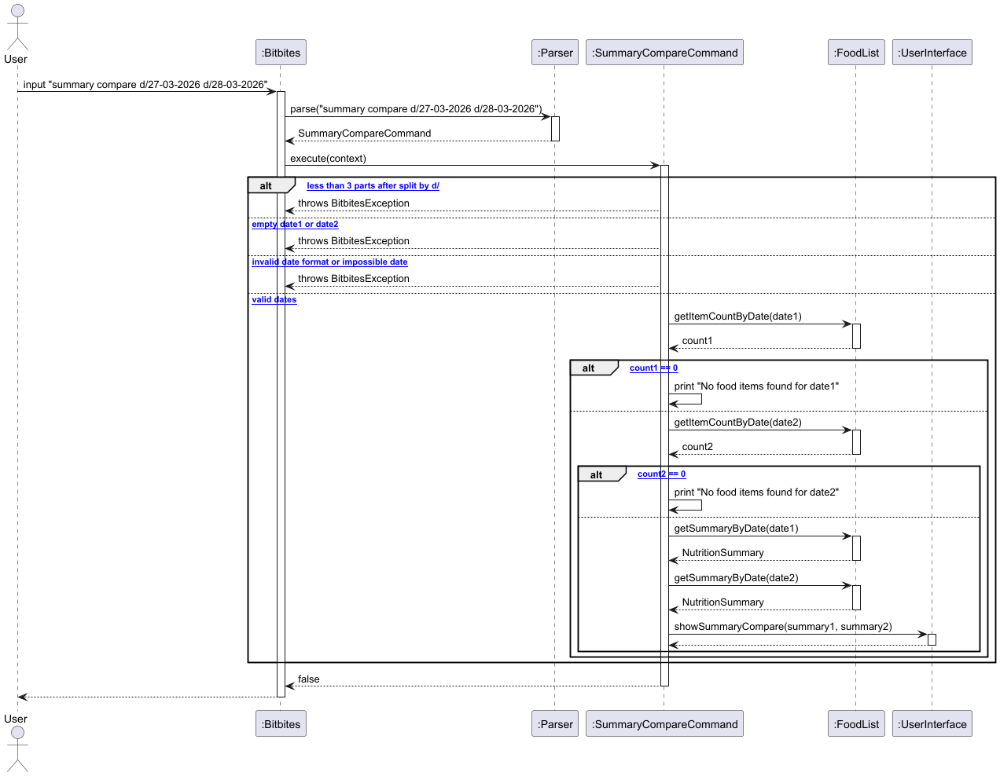

---

### 13. History Commands `history`

The `history` feature shows a chronological log of all recorded days. It supports four sub-commands.

| Command | Description |
|---------|-------------|
| `history` | All recorded days with breakdown bars |
| `history /top N` | Top N highest calorie days |
| `history /best N` | Top N days closest to daily calorie goal |
| `history streak` | Current and longest consecutive recording streak |

#### 13.1 Implementation Details

**`history`:**
`HistoryCommand` checks whether any food has been logged today using `LocalDate.now()`. It retrieves all daily summaries and passes them with a `recordedToday` flag to `ui.showHistory()`, which appends a reminder if today has not been logged.

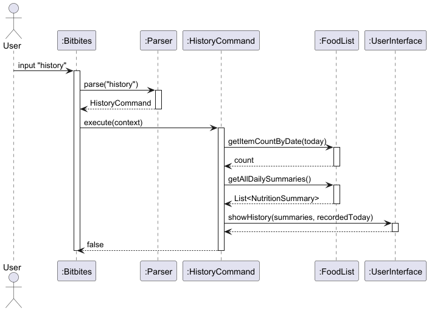

**`history /top N`:**
`HistoryTopCommand` splits the command by `/top` to extract `N`. It calls `foodList.getTopDaysByCalories(N)` which sorts summaries by total calories descending and returns the top N.

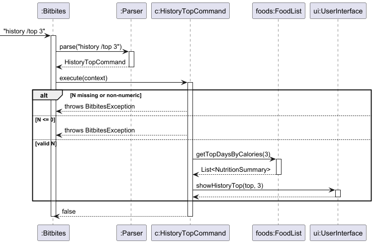

**`history /best N`:**
`HistoryBestCommand` calls `foodList.getDaysClosestToGoal(n, calorieGoal)`, which sorts summaries by `|totalCalories - dailyCalorieGoal|` ascending, surfacing the days where intake was closest to the user's target.

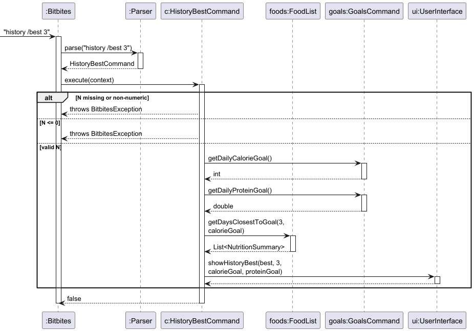

**`history streak`:**
`HistoryStreakCommand` calls `getCurrentStreak()` and `getLongestStreak()`. Streak calculation uses `LocalDate.parse()` with `dd-MM-yyyy` format to compare consecutive dates. `getCurrentStreak()` also checks whether the last recorded date is today or yesterday using `LocalDate.now()` — if neither, the streak returns 0.

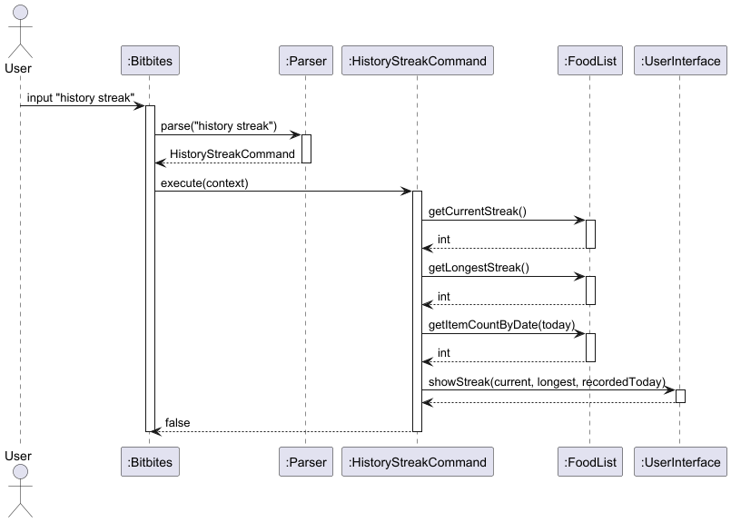

---

### 13. Storage Components

BitBites uses two independent storage classes — `ProfileStorage` and `GoalsStorage` — both located in the `storage` package. Each class reads and writes plain-text key-value files stored in the `data/` directory.

#### 13.1 File Naming Convention

Both storage classes derive a safe filename from the user's name by converting it to lowercase and replacing spaces with underscores:

```
data/<safeName>_profile.txt
data/<safeName>_goals.txt
```

For example, a user named `"John Doe"` produces the files `data/john_doe_profile.txt` and `data/john_doe_goals.txt`. This allows multiple users to maintain independent data on the same system.

#### 14.2 File Formats

**Profile file** (`<n>_profile.txt`):
```
name=VALUE
gender=VALUE
age=VALUE
weight=VALUE
height=VALUE
```

**Goals file** (`<n>_goals.txt`):
```
dailyCalories=VALUE
dailyProtein=VALUE
weeklyCalories=VALUE
weeklyProtein=VALUE
```

Both files are read line-by-line in a fixed order. Each line is split on the `=` character and the second element is parsed into the appropriate type (`int`, `double`, or `String`).

#### 14.3 Error Handling

Both `loadProfile()` and `loadGoals()` return `null` if the file does not exist or if any line fails to parse (caught via `IOException` or `NumberFormatException`). Callers treat a `null` return as "no saved data" and fall back to defaults. This means a corrupted or missing file degrades gracefully without crashing the application.

#### 14.4 Key Public Methods

| Class | Method | Description |
|---|---|---|
| `ProfileStorage` | `saveProfile(Profile)` | Writes profile fields to disk |
| `ProfileStorage` | `loadProfile(String name)` | Reads and returns a `Profile`, or `null` |
| `ProfileStorage` | `profileExists(String name)` | Checks if a profile file exists |
| `ProfileStorage` | `deleteProfile(String name)` | Deletes the profile file |
| `GoalsStorage` | `saveGoals(name, dc, dp, wc, wp)` | Writes all four goal values to disk |
| `GoalsStorage` | `loadGoals(String name)` | Returns a `double[]` of four values, or `null` |
| `GoalsStorage` | `goalsExist(String name)` | Checks if a goals file exists |

---

## Appendix A: Product Scope

### Target User Profile

BitBites targets health-conscious individuals who want to track their daily food intake and nutritional progress. The ideal user:

- Is comfortable using a command-line interface and prefers typing to clicking
- Tracks calories and protein regularly as part of a fitness or dietary routine

### Value Proposition

Many people want to eat healthier but face a common set of barriers: they do not know how to estimate the calories or protein in their meals, they find existing
food tracking apps too complex or high-friction to use consistently, and they lack the nutritional expertise to judge whether what they are eating is actually good for them.

BitBites addresses these problems directly:

- **Lowering the knowledge barrier.** The `tips` command provides quick reference data for common foods and portion sizes, helping users make reasonable estimates
  even without a nutrition label in front of them.

- **Reducing friction.** BitBites is a lightweight command-line tool with no account registration, no internet connection required, and no graphical interface
  to navigate. Users can log a meal in a single line. The lower the effort to log, the more likely a user is to sustain the habit long-term.

- **Personalised goal-setting.** By entering a basic profile (age, weight, height, gender), users receive an automatically calculated daily calorie target based on
  their BMR. This removes the guesswork of deciding how much to eat.

- **Visibility into patterns.** The `summary` and `history` commands let users see not just today's intake but trends over time — which days they overate, which days
  they hit their goals, and whether their habits are improving.

- **Accountability without complexity.** Daily progress is shown automatically after every meal is logged, and streak tracking encourages users to keep logging
  consistently without gamifying the experience in an overwhelming way.

In short, BitBites is designed for users who are motivated to eat better but need a tool that is fast to use, easy to understand.

---

## Appendix B: User Stories

| Version | As a ...                        | I want to ...                                              | So that I can ...                                             |
|---------|---------------------------------|------------------------------------------------------------|---------------------------------------------------------------|
| v1.0    | new user                        | see all available commands                                 | quickly learn how to use the application                      |
| v1.0    | user                            | add a food item with its name, calories, protein and date  | track my daily nutritional intake                             |
| v1.0    | user                            | view a list of all food items I have logged                | recall what I have consumed                                   |
| v1.0    | user                            | view food items for a specific date                        | review what I ate on a particular day                         |
| v1.0    | clumsy user                     | delete a specific food entry                               | remove items I added by mistake                               |
| v1.0    | user                            | edit the details of an existing entry                      | correct mistakes without deleting and re-adding               |
| v1.0    | gym goer                        | track my protein intake per day                            | see how much protein I am consuming                           |
| v1.0    | user who forgets to use the app | fill in an entry for a missed meal on an earlier date      | keep the record complete and easy to review                   |
| v2.0    | user                            | set up my profile with my name                             | have the app feel personalised to me                          |
| v2.0    | user                            | set a daily calorie and protein goal                       | track my progress against a personal target                   |
| v2.0    | user                            | view my daily progress after logging a meal                | know how many calories I have left for the day                |
| v2.0    | user                            | view a nutritional summary for a specific date             | see how my intake compares to my goals on that day            |
| v2.0    | user                            | view a trend summary over a date range                     | identify patterns in my eating habits over time               |
| v2.0    | user                            | compare two days side by side                              | understand how my intake varies between days                  |
| v2.0    | user                            | view my full food history with visual breakdowns           | get a quick overview of my eating history                     |
| v2.0    | user                            | see my top highest calorie days                            | identify my heaviest eating days                              |
| v2.0    | user                            | see the days where I was closest to my calorie goal        | understand what a balanced day looks like for me              |
| v2.0    | user                            | track my consecutive logging streak                        | stay motivated to log food every day                          |
| v2.0    | user                            | save my height, weight, age and gender                     | get a personalised calorie goal based on my BMR automatically |
| v2.0    | frequent user                   | save food presets for meals I eat often                    | log commonly eaten meals without retyping all the details     |
| v2.0    | returning user                  | have my goals and profile saved between sessions           | not have to re-enter them every time I launch the app         |
| v2.0    | user who forgets to use the app | fill in an entry for a missed meal on an earlier date      | keep my history complete and easy to review                   |
| v2.0    | user                            | get tips on estimating calories and protein                | log food accurately even without exact nutritional data       |
---

## Appendix C: Non-Functional Requirements

1. **Portability:** The application should run on any system with Java 17 or later installed, without requiring additional software or internet access.
2. **Performance:** All commands should respond within 1 second for a food list of up to 1000 entries.
3. **Data integrity:** If the data file is missing or corrupted, the application should degrade gracefully by starting with an empty list rather than crashing.
4. **Usability:** A user who has never used the application should be able to log their first meal within 2 minutes of launching it, using only the `help` command as a reference.
5. **Persistence:** All food entries, goals, and profile data must be saved to disk automatically and restored on the next launch without any user action.

---

## Appendix D: Glossary

|## Appendix D: Glossary

| Term                     | Definition                                                                                                                                                                                                                                                             |
|--------------------------|------------------------------------------------------------------------------------------------------------------------------------------------------------------------------------------------------------------------------------------------------------------------|
| **Command Pattern**      | A software design pattern where each user action is encapsulated as a separate class with an `execute()` method. Used in BitBites so that `Parser` only creates Command objects, and `Bitbites` calls `execute()` — separating parsing from execution.                 |
| **AppContext**           | A context object that bundles `FoodList`, `PresetList`, and `UserInterface` into a single parameter passed to every command's `execute()` method. Follows the Context Object pattern to avoid updating every command's method signature when new components are added. |
| **NutritionSummary**     | A data class that stores aggregated nutritional data (total calories, total protein, item count, food item list) for a given date or date range. Computed by `FoodList` and passed to `UserInterface` for display.                                                     |
| **ProgressBar**          | A utility class that generates segmented ASCII bars where each segment represents one meal's calorie proportion. Bar width is scaled relative to a maximum value for cross-day trend comparisons.                                                                      |
| **BitbitesException**    | A custom `RuntimeException` used throughout the application to signal user-facing errors. Caught in the main loop and displayed via `ui.showError()`.                                                                                                                  |
| **BMR**                  | Basal Metabolic Rate. Computed in the `Profile` model using the Mifflin-St Jeor formula. Used by `GoalsCommand.autoSetGoalsFromBmr()` to automatically set the user's daily calorie goal.                                                                              |
| **BMI**                  | Body Mass Index. Computed in the `Profile` model as `weight / (height in metres)²`. Categorised into Underweight, Normal, Overweight, or Obese using standard thresholds.                                                                                              |
| **Streak**               | A count of consecutive days with at least one logged food entry. Computed in `FoodList.getCurrentStreak()` and `getLongestStreak()` using `LocalDate` comparisons. The current streak returns 0 if the most recent entry is not from today or yesterday.               |
| **Preset**               | A `Food` object stored in `PresetList` with date set to `"PRESET"`. Used as a template by `PresetCommand` to quickly log a food entry without re-entering nutritional details.                                                                                         |
| **Storage**              | The `Storage` class in the `storage` package handles reading and writing of food logs and presets to plain-text files. Each line follows the format `NAME \| CALORIES \| PROTEIN \| DATE`.                                                                             |
| **Per-user file naming** | Profile and goals files are named using a lowercase version of the username with spaces replaced by underscores (e.g., `john_doe_profile.txt`). This allows multiple users to coexist on the same system.                                                              |

---

## Appendix E: Instructions for Manual Testing

The following instructions guide a tester through the main features of BitBites.
This is not an exhaustive list — testers are encouraged to explore edge cases and variations beyond what is described here.

### E.1 Initial Launch

1. Ensure the `data/` folder does not exist or is empty.
2. Run `java -jar bitbites.jar`.
3. Enter any name when prompted (e.g., `James`).
4. Verify that the application starts cleanly with no food items loaded.
5. Run `list` and verify the list is empty.

### E.2 Testing Basic Food Logging (v1.0)

1. Add a food item:
```
   add n/Chicken Rice c/500 p/30 d/01-04-2026
```
Verify: Confirmation message is shown with a daily progress summary.

2. Add a second item on the same date:
```
   add n/Salad c/200 p/10 d/01-04-2026
```
Verify: Both items appear when running `list d/01-04-2026`.

3. Add an item on a different date:
```
   add n/Burger c/700 p/25 d/02-04-2026
```

4. List all items:
```
   list
```
Verify: All three items are shown with 1-based indices.

5. List by date:
```
   list d/01-04-2026
   list d/05-04-2026
```
Verify: First command shows only the two items on that date.
Second command shows no results.

### E.3 Testing Delete (v1.0)

1. Delete an item:
```
   delete 1
```
Verify: Confirmation is shown. `list` reflects the removal. Daily progress
summary is updated.

2. Delete with an invalid index:
```
   delete 99
   delete abc
   delete
```
Verify: Each produces an appropriate error message.

### E.4 Testing Edit (v2.0)

1. Edit a single field:
```
   edit 1 n/Hainanese Chicken Rice
```
Verify: Only the name is updated. Calories, protein and date are unchanged.

2. Edit multiple fields at once:
```
   edit 1 c/520 p/35
```
Verify: Calories and protein are updated. Name and date are unchanged.

3. Edit with an invalid index:
```
   edit 99 n/Test
```
Verify: Error message is shown. No item is modified.

### E.5 Testing Goals (v2.0)

1. View default goals:
```
   goals
```
Verify: Default daily goal of 2000 kcal and 50.0g protein is shown.

2. Set new goals:
```
   goals set dc/2500 dp/60 wc/17500 wp/420
```
Verify: Updated goals are confirmed.

3. View updated progress:
```
   goals
```
Verify: Progress is shown against the new targets.

4. Set an invalid goal value:
```
   goals set dc/-100
```
Verify: Error message is shown. Goal is not updated.


### E.6 Testing Profile (v2.0)

1. Set a profile:
```
   profile set n/James g/male a/25 w/70 h/175
```
Verify: Profile is displayed with BMI and BMR values. Daily and weekly calorie goals are automatically updated to reflect the BMR.

2. View the profile:
```
   profile
```
Verify: All five fields plus BMI and BMR are shown correctly.

3. Update a single field:
```
   profile set w/75
```
Verify: Only weight is updated. All other fields are preserved.

4. Set an invalid gender:
```
   profile set g/other
```
Verify: Error message is shown. Profile is not updated.

5. Clear the profile:
```
   profile clear
```
Verify: Profile is deleted. Running `profile` shows the setup prompt.


### E.7 Testing Summary Commands (v2.0)

1. Summary for a specific date:
```
   summary d/01-04-2026
```
Verify: Total calories and protein shown. Per-item percentage breakdown displayed. Goal status shown (remaining or reached).

2. Summary for a date with no data:
```
   summary d/05-04-2026
```
Verify: "No food items found" message is shown.

3. Summary over a date range:
```
   summary from/01-04-2026 to/02-04-2026
```
Verify: Both dates shown with bars. Days within 20% of calorie goal
are marked with `✓`.

4. Summary range with start after end:
```
   summary from/02-04-2026 to/01-04-2026
```
Verify: Error message is shown.

5. Compare two dates:
```
   summary compare d/01-04-2026 d/02-04-2026
```
Verify: Both days shown side by side with calorie and protein differences.

6. Compare with a date that has no data:
```
   summary compare d/01-04-2026 d/05-04-2026
```
Verify: "No food items found" message for the empty date.


### E.8 Testing History Commands (v2.0)

First add food items across multiple consecutive and non-consecutive dates:
```
add n/Oats c/300 p/10 d/27-03-2026
add n/Pasta c/600 p/20 d/28-03-2026
add n/Steak c/800 p/50 d/29-03-2026
add n/Soup c/250 p/15 d/31-03-2026
```

1. View full history:
```
   history
```
Verify: All four dates shown in chronological order with breakdown bars.
A reminder is shown if today has no logged food.

2. Top N highest calorie days:
```
   history /top 2
```
Verify: Top 2 days shown in descending calorie order.

3. Top N closest to goal:
```
   history /best 2
```
Verify: 2 days shown whose calories are closest to the daily calorie goal.

4. Invalid N values:
```
   history /top 0
   history /top abc
   history /best -1
```
Verify: Each produces an appropriate error message.

5. Streak tracking:
```
   history streak
```
Verify: Current streak shown as 1 (since 31-03 is the last entry and
there is a gap before it). Longest streak shown as 3 (27-03 to 29-03).

### E.9 Testing Find Command (v2.0)

1. Find an existing food item:
```
find Soup
```
Verify: All entries with the exact name "Soup" are shown with calories and protein.

2. Find a name that does not exist:
```
find Pizza
```
Verify: "No food items found" message is shown.


### E.10 Testing Preset Commands (v2.0)

1. Add a preset:
```
preset add n/Protein Shake c/200 p/30
```
Verify: Confirmation shown. Preset saved with name, calories, and protein.

2. Add a preset with missing fields:
```
preset add n/Oats c/150
```
Verify: Error message shown. Preset is not added.

3. Add a preset with invalid values:
```
preset add n/Oats c/-50 p/5.0
```
Verify: Error message shown. Preset is not added.

4. List presets:
```
preset list
```
Verify: All saved presets shown with 1-based indices.

5. Use a preset with today's date:
```
preset use 1
```
Verify: Food entry added to the list with today's date. Running `list` shows the new entry.

6. Use a preset with a custom date:
```
preset use 1 d/15-04-2026
```
Verify: Food entry added with the specified date `15-04-2026`.

7. Use a preset with an invalid date format:
```
preset use 1 d/2026/04/15
```
Verify: Error message shown. No entry added.

8. Delete a preset:
```
preset delete 1
```
Verify: Preset removed. Running `preset list` reflects the change.

9. Delete a preset with an invalid index:
```
preset delete 99
preset delete abc
```
Verify: Each produces an appropriate error message.

10. Use a preset on an empty preset list:
```
preset use 1
```
(Run this after deleting all presets.)
Verify: Error message shown indicating no presets are saved.


### E.11 Testing Login Command (v2.0)

1. Switch to a new user:
```
login
```
Enter a name that has no existing profile (e.g., `Alice`).
Verify: Welcome message shown for new user. Prompt to set up a profile is displayed.

2. Switch to a returning user:
```
login
```
Enter a name that has an existing profile (e.g., `James`, after completing E.6).
Verify: "Welcome back" message shown. Profile summary (BMI, BMR) is displayed.

3. Goals are loaded for the new user:
   After logging in as `Alice`, run:
```
goals
```
Verify: Goals shown reflect Alice's saved goals (or defaults if none saved).

4. Login with an empty name:
```
login
```
Press Enter without typing a name.
Verify: Error message shown. Session is not switched.

5. Verify user isolation:
- Log in as `James` and add a food item.
- Log in as `Alice` and run `list`.
  Verify: Note that food logs are currently shared across users (this is a known limitation).


### E.12 Testing Help, Tips and Motivate
```
help
tips
motivate
exit
```

Verify: `help` lists all available commands with their formats.
`tips` shows calorie and protein reference data for common foods and Singaporean meals.
`motivate` shows a random motivational message.
`exit` shows a farewell message and closes the application.
